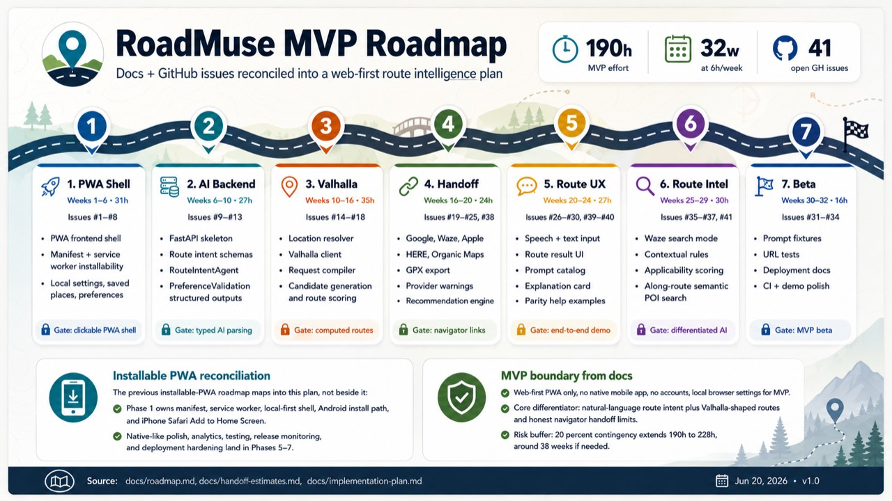

# Roadmuse

Roadmuse is a product and engineering initiative aimed at building an intelligent navigation and travel planning experience. This repository contains strategic documentation, architecture notes, and implementation planning for the project.

## Documentation

This repository is primarily documented in the `docs/` folder. Key references include:

- [docs/architecture.md](docs/architecture.md) — system architecture and design
- [docs/requirements.md](docs/requirements.md) — product requirements and success criteria
- [docs/use-cases.md](docs/use-cases.md) — target user journeys and scenarios
- [docs/user-stories.md](docs/user-stories.md) — detailed user stories and feature context
- [docs/roadmap-and-estimates.md](docs/roadmap-and-estimates.md) — project roadmap, milestones, and estimates
- [docs/implementation-plan.md](docs/implementation-plan.md) — implementation planning and execution strategy
- [docs/ai-agent-build-guide.md](docs/ai-agent-build-guide.md) — guidance for building AI agent capabilities
- [docs/external-navigator-support.md](docs/external-navigator-support.md) — external navigator integration notes
- [docs/competitor-landscape.md](docs/competitor-landscape.md) — competitive analysis
- [docs/problem-solution.md](docs/problem-solution.md) — problem statement and solution overview
- [docs/lean-canvas.md](docs/lean-canvas.md) — business model and value proposition
- [docs/ticket-estimates.md](docs/ticket-estimates.md) — ticket-level effort estimates

## Getting Started

1. Read the documentation in `docs/` to understand the project vision, requirements, and architecture.
2. Use the planning and roadmap files to align implementation priorities.
3. Start the frontend with `make install` then `make run-spa` (see below).

### Frontend app

This repository now includes a lightweight React + TypeScript + Vite SPA under `spa/`.

- Run `make install` to install frontend and backend dependencies.
- Run `make run-spa` to start the local SPA.
- Run `cd spa && npm run build` or `make build-spa` to verify the SPA builds successfully.

The app currently includes:

- A mobile-first route shell.
- Browser routing for Main, Config, and Help pages.
- A fixed bottom navigation shared across screens.

### Backend app

The repository includes a FastAPI backend skeleton under `backend/` (Issue #10).
It provides the app factory, CORS, env-based config, a `/health` endpoint, and
OpenAPI docs. See [backend/README.md](backend/README.md) for details.

- Requires Python 3.12+ and [uv](https://docs.astral.sh/uv/).
- Run `cd backend && uv sync` to install backend dependencies (or `make install`).
- Run `make run-backend` to start the API at http://127.0.0.1:8000 (`/health`, `/docs`).

### Developer commands

- `make install` — install SPA and backend dependencies.
- `make install-hooks` — install the repo pre-commit hook (one-time setup).
- `make run-spa` — start the Vite dev server for the SPA.
- `make run-backend` — start the FastAPI dev server.
- `make build-spa` — build the SPA for local verification.
- `make build-pages` — build the SPA for GitHub Pages.
- `make lint` — run lint/type-check (SPA `tsc --noEmit`; backend `ruff` + `mypy`).
- `make test` — run unit tests with coverage; the shared threshold is 80% minimum.

## Repository Structure

- `docs/` — project documentation and planning artifacts
- `spa/` — React + TypeScript + Vite SPA source, assets, and Node package files
- `backend/` — FastAPI backend skeleton

## Contribution

If you're working on Roadmuse, start by reviewing the documentation and then contribute updates to the docs or implementation artifacts as needed.
