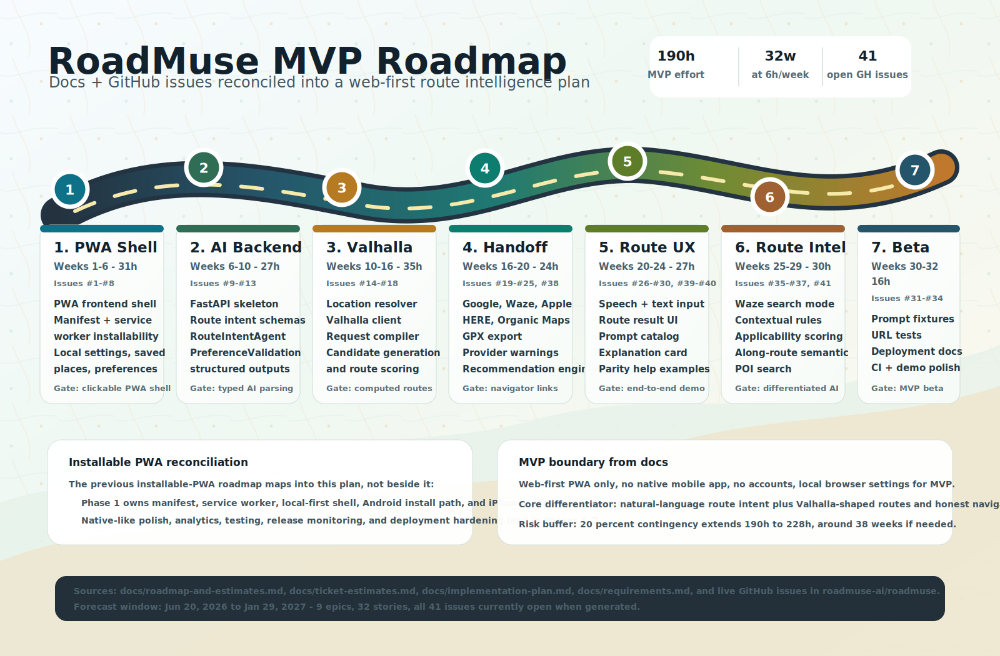

# Roadmuse

Roadmuse is a product and engineering initiative aimed at building an intelligent navigation and travel planning experience. This repository contains strategic documentation, architecture notes, and implementation planning for the project.

## Documentation

This repository is primarily documented in the `docs/` folder. Key references include:

- [docs/architecture.md](docs/architecture.md) — system architecture and design
- [docs/requirements.md](docs/requirements.md) — product requirements and success criteria
- [docs/use-cases.md](docs/use-cases.md) — target user journeys and scenarios
- [docs/user-stories.md](docs/user-stories.md) — detailed user stories and feature context
- [docs/roadmap-and-estimates.md](docs/roadmap-and-estimates.md) — project roadmap, milestones, and estimates
- [docs/implementation-plan.md](docs/implementation-plan.md) — implementation planning and execution strategy
- [docs/ai-agent-build-guide.md](docs/ai-agent-build-guide.md) — guidance for building AI agent capabilities
- [docs/external-navigator-support.md](docs/external-navigator-support.md) — external navigator integration notes
- [docs/competitor-landscape.md](docs/competitor-landscape.md) — competitive analysis
- [docs/problem-solution.md](docs/problem-solution.md) — problem statement and solution overview
- [docs/lean-canvas.md](docs/lean-canvas.md) — business model and value proposition
- [docs/ticket-estimates.md](docs/ticket-estimates.md) — ticket-level effort estimates

## Getting Started

1. Read the documentation in `docs/` to understand the project vision, requirements, and architecture.
2. Use the planning and roadmap files to align implementation priorities.

## Repository Structure

- `docs/` — project documentation and planning artifacts

## Contribution

If you're working on Roadmuse, start by reviewing the documentation and then contribute updates to the docs or implementation artifacts as needed.
