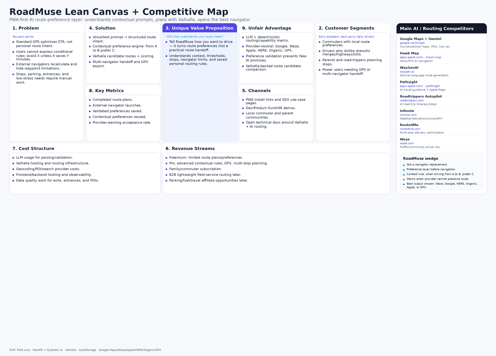

# Lean Canvas

See the generated image:

## Summary

RoadMuse is a PWA-first AI route-preference planner. The core wedge is contextual and conditional preference routing:

- “When driving from A to B, prefer C.”
- “Avoid X unless it saves Y minutes.”
- “Use Waze for final navigation, but warn me if Waze cannot preserve route shaping.”

## Main AI Competitors Included

- Google Maps + Gemini — https://www.google.com/maps
- Hawk Map — https://apps.apple.com/us/app/hawk-map/id6754956497
- WayGenAI — https://www.waygen.ai
- Pathsight — https://apps.apple.com/us/app/pathsight-ai-travel-agent/id6740884888
- Roadtrippers Autopilot — https://roadtrippers.com
- inRoute — https://inroute.com
- Route4Me — https://route4me.com
